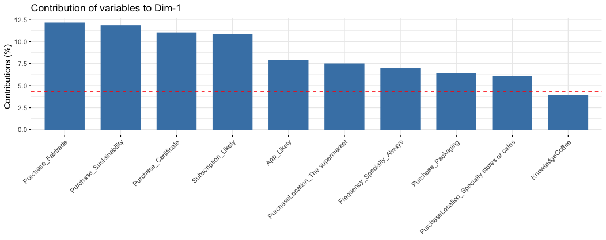

```{r setup, include=FALSE}
knitr::opts_chunk$set(echo = TRUE, class.source = "watch-out", options(scipen=999), warning=FALSE, message=FALSE, comment="") 
source("www/init.R")
source("www/Table_Design.R")
```

```{r, echo=FALSE}
htmltools::img(
  src = knitr::image_uri(file.path("www/BSM_Logo.png")), 
  alt = 'logo', 
  style = 'position:absolute; top:0; right:5px; padding:10px; width:200px'
)
```

<br>

<br>

<br>

<br>

<br>

<br>

{width="626"}

<br>

<br>

<br>

<br>

<br>

<br>

<br>

**Prepared by:** Daniëlle Kotter**\
Prepared for:** Michael Greenacre**\
Program:** Msc in Management, Barcelona School of Management\
**Date:** 2nd July 2021

\newpage

```{r data, echo=FALSE, include=FALSE}
data <- read_excel("DataSet/Main doc survey.xlsx")
attach(data)
dani <- c( "#ffa500", "#34495E", "#69b3a2", "#ffd561", "#ee5c42", "#DAF7A6", "#C8A2C8", "#5c3170", "#990000", "#C70039", "#34495E", "#909497")

#Loading packages
library(devtools)
library(ggbiplot)
library(FactoMineR)
library(factoextra)
library(ggrepel)

data <- separate(
  data,
  Criteria_Type_Coffee,
  into = c("Criteria_A", "Criteria_B"),
  sep = "([,])",
  remove = TRUE,
  convert = FALSE,
  extra = "drop",
  fill = "right",
)

data <- separate(
  data,
  Subscription_Not_Likely,
  into = c("Subscription_A", "Subscription_B"),
  sep = "([,])",
  remove = TRUE,
  convert = FALSE,
  extra = "drop",
  fill = "right",
)

data <- separate(
  data,
  "Supermarket_Negative_ Reasons",
  into = c("Supermarket_NO_A", "Supermarket_NO_B"),
  sep = "([,])",
  remove = TRUE,
  convert = FALSE,
  extra = "drop",
  fill = "right",
)

data <- separate(
  data,
  "Supermarket_Positive_ Reasons",
  into = c("Supermarket_YES_A", "Supermarket_YES_B"),
  sep = "([,])",
  remove = TRUE,
  convert = FALSE,
  extra = "drop",
  fill = "right",
)

# Excluding variables from the data set
data <- data[,-match(c("Language", "Participant", "Home", "Occupation", "Gender", "Education", "AgeCategory", "Criteria_A", "Criteria_B", "Subscription_B", "Supermarket_NO_B", "Supermarket_YES_A", "Supermarket_YES_B", "Machine", "MoneyGroceries", "AmountOutMonth", "Subscription_A", "Supermarket_NO_A"),names(data))]

# Creating dummy variables through one-hot encoding
dataf <- dummy_cols(data, select_columns = c("BrandChange", "PurchaseLocation", "Frequency_Specialty"), remove_selected_columns = TRUE, ignore_na = TRUE)

# Preparing the Data
Orgdata <- na.omit(dataf[,c(11:23)]) #listwise deletion of missing
NewData <- scale(dataf[,c(0:23)]) # standardize variables

set.seed(1234)

# K-Means Cluster Analysis
fit <- kmeans(na.omit(NewData), centers = 3, nstart = 50) #3 cluster solution
```

## Introduction

As a final project for the Master of Science in Management at Barcelona
School of Management, I prepared a business plan. This entailed
developing a business opportunity and performing consumer research to
gain a better understanding of the market. The business concept is a
sustainable specialty coffee company that has a subscription based
model.

For the purpose of the business plan, I conducted a survey and collected
a sample of 235 participants. The survey was designed to gain insights
on coffee habits and purchasing decisions of coffee consumers. The goal
of this particular research was to quantitatively confirm hypothesis and
establish general patterns across several contexts. Ultimately, the
objective of the primary research was to decrease the risk of the
business opportunity, discover unexpected findings and provide
opportunity to challenge the market through competitive advantages.

The following report includes a clustering approach to buyer personas, a
principal component and a correspondence analysis. After initially
evaluating univariate descriptions of the entire sample throughout the
business plan, the next step was to perform cluster analysis for the
purpose of identifying patterns in attitude and preferences to create
segments of consumers for marketing purposes. These segments (or cluster
groups) are then profiled to create the "buyer personas". The most
promising buyer persona will then be targeted in the positioning and
marketing strategy.

The principal component analysis strives to find the attributes that
differentiates the cluster groups. Lastly, the correspondence analysis
evaluates the difference between the behaviors or habits within
variation of explanatory variables.

## Data

The survey covers several sections: basic demographics, socioeconomic,
consumption and purchasing behavior and interest in social missions. The
sample size was 235 and includes 0 missing values. Moreover, there are
25 mixed-scale variables included in the data set. These vary from
continuous numerical, discrete numerical, and categorical variables. The
next page displays an overview of all variable names, the question asked
to consumers and the scale.

\newpage

### Data set

|                          Field | Description                                                                            | Scales                  |
|-------------------------------:|:---------------------------------------------------------------------------------------|-------------------------|
|                     AmountWeek | How many cups of coffee do you typically consume weekly?                               | Ratio, Continuous       |
|                Am ountOutMonth | How frequently do you drink out-of-home per month on average?                          | Ratio, Continuous       |
|                    MoneyCoffee | How much money on average do you estimate you spend on coffee per month?               | Ratio, Continuous       |
|                Mo neyGroceries | How much on average do you spend on general groceries per month?                       | Ratio, Continuous       |
|                        Machine | How do you brew your coffee at home?                                                   | Nominal                 |
|                   Brand change | How often do you switch between coffee brands?                                         | Nominal                 |
|              Purchase location | Where do you usually purchase your coffee?                                             | Nominal                 |
| Supe rmarket_Posi tive_Reasons | When you purchase coffee from the supermarket what are your main reasons for doing so? | Nominal                 |
| Supe rmarket_Nega tive_Reasons | What would be reasons why you would not purchase coffee from the supermarket?          | Nominal                 |
|           Criteri a_Type_Cofee | What are your main criteria's or evaluation points for choosing the type of coffee?    | Nominal                 |
|               Kno wledgeCoffee | How would you describe your knowledge level regarding coffee in general?               | Ordinal. 0-10, Discrete |
|                Pu rchase_Price | I believe that the \_\_\_\_ is important to my decision on which coffee to purchase.   | Ordinal, likert 0-5     |
|       Purchase_Su stainability | I believe that the \_\_\_\_ is important to my decision on which coffee to purchase.   | Ordinal, likert 0-5     |
|       Purchase_Su stainability | I believe that the \_\_\_\_ is important to my decision on which coffee to purchase.   | Ordinal, likert 0-5     |
|            Purcha se_Fairtrade | I believe that the \_\_\_\_ is important to my decision on which coffee to purchase.   | Ordinal, likert 0-5     |
|            Purcha se_Packaging | I believe that the \_\_\_\_ is important to my decision on which coffee to purchase.   | Ordinal, likert 0-5     |
|           Frequen cy_Specialty | How often do you drink specialty coffee?                                               | Ordinal                 |
|           Subscri ption_Likely | How likely are you to have an online subscription for (specialty) coffee?              | Ordinal 0-10, Discrete  |
|       Subscriptio n_Not_Likely | What is the number one reasons why you would be hesitant?                              | Nominal                 |
|                     App_Likely | How likely are you to value and use an app for your online subscription?               | Ordinal, 0-10, Discrete |
|                         Gender | What is your gender?                                                                   | Nominal                 |
|                    AgeCategory | What is your age category?                                                             | Ordinal                 |
|                     Occupation | What is your occupational status?                                                      | Nominal                 |
|                      Education | What level of education have you completed?                                            | Ordinal                 |
|                           Home | How would you describe the place you currently live in?                                | Nominal                 |

\newpage

Below the head of the data set is displayed to give an idea regarding
choice options within variables.

```{r, echo=FALSE}
data <- read_excel("DataSet/Main doc survey.xlsx")
my_table(head(data[,2:7]))
```

<br>

```{r, echo=FALSE}
my_table(head(data[,8:11]))
```

<br>

```{r, echo=FALSE}
my_table(head(data[,12:16]))
```

<br>

\newpage

```{r, echo=FALSE}
my_table(head(data[,17:20]))
```

```{r, echo=FALSE}
my_table(head(data[,21:26]))
```

## Methodology

### Sample & data collection

A random probability-based sample technique was adopted due to time
consideration and availability. The platform used for data collection is
google sheets. The sample has been reached through multiple methods,
including numerous Facebook groups and personal contacts near the
region. The Facebook groups used for the research project were:
Utrecht!, with almost 24 thousand members and expats in Utrecht, with
over 31 thousand members. This is a form of convenience sampling where
any member of the population is invited to participate without a
dependent of the presence of the sampling frames.

### Approach to data analysis

After the univariate analysis, the technique of k-means clustering is
applied. Hereby patterns in the data are identified to find groups of
respondents that are similar to one another and yet different from the
others. These groups / clusters are used for profiling and thus
determining the buyer personas. Subsequently, the buyer personas will be
based on computational usage and theory ultimately for segmentation.

Moreover, I want to learn whether there is a variance in attitudes
within demographic groups and what factors mostly drive the variance
between consumers. Therefore, Correspondence analysis & Principal
Component Analysis is additionally included in this analysis. The report
follows several steps:

1.  Preparing the data. Re-scaling & selecting the variables for
    analysis
2.  Clustering analysis, excluding demographics
3.  Individual cluster analysis - profiling
4.  Principal Component Analysis
5.  Correspondence analysis, bringing in demographics

Naturally this additionally entails visualization and hypothesis
testing.

\newpage

## Results

### Clustering Analysis

#### Selecting the variables

The first step to the clustering analysis was selecting the variables
that could be valuable to distinguish groups of customers. Initially the
pairs panel was used to analyze the numerical variables. The first
observation is that the variables subscription likelihood and app
likelihood have a strong positive relationship with a correlation
coefficient of 0.67. Expectantly when consumers are more likely to set
up a subscription they are also more likely to setup an app. This is
further confirmed through a chi-square test where the variables are
associated with a 1% significance level.

Moreover, the next highest correlation with subscription likelihood is
knowledge of coffee. To further analyze this relationship, a chi-square
test was performed which showed that there is a statistically
significant relationship at a 5% significance level. Suggesting that
having higher knowledge of coffee leads to a positive effect on the
likelihood of setting up an subscription.

```{r, echo=FALSE, out.width="90%"}
dataset <- read_excel("DataSet/Main doc survey.xlsx")

lAmountWeek <- log(AmountWeek)
AmountOutMonth <- AmountOutMonth
lMoneyCoffee <- log(MoneyCoffee)
MoneyGroceries <- MoneyGroceries
lKnowledgeCoffee <- log(KnowledgeCoffee)
lSubscription_Likely <- log(Subscription_Likely)
lApp_Likely <- log(App_Likely)

dataPairs <- data.frame(lAmountWeek, AmountOutMonth, lMoneyCoffee, MoneyGroceries, KnowledgeCoffee, Subscription_Likely, App_Likely)
pairs.panels(dataPairs,
method = "pearson",
hist.col = "#00AFBB",
density = TRUE,
ellipses = TRUE
)
```

The highest linear correlation between the likeliness to setup an
subscription is between the importance of coffee being fair trade and
sustainable for purchasing decisions. Nevertheless, there is a weak
positive correlation. What is evident is that the sustainability, fair
trade and certificate variables are all moderately-highly positively
correlated. This suggests that a higher score giving for one of these
questions, also gives a higher score to the alternatives.

```{r, echo=FALSE, out.width="90%"}
dataset <- read_excel("DataSet/Main doc survey.xlsx")
dataset <- dataset[,c(13:17, 19)]
pairs.panels(dataset,
method = "pearson",
hist.col = "#00AFBB",
density = TRUE,
ellipses = TRUE
)
```

The demographic variables naturally were excluded from the cluster
analysis considering the goal of the buyer personas was to find insights
on consumer preferences and not demographic differences.

To ultimately decide which variables to keep for the analysis, all
variables primarily were included and then tested on whether there was
significant difference between the centroids of the cluster groups. The
non-parametric Kruskal-Wallis chi-squared test was hereby applied,
ranking variables on whether they are alike. The variables that would
show the highest significance difference between cluster groups would be
selected for the analysis. Ultimately this leads to the variables
selected for clustering to be:

1\. Purchasing Location

2\. Frequency Specialty coffee consumption

3\. Amount brand change

4\. Amount consumed per week

5\. Money spend on coffee

6\. Likeliness to set up and app

7\. Likeliness to set up and subscription

8\. Purchasing importance - Fair trade

9\. Purchasing importance - Certificate

10\. Purchasing importance - Sustainability

11\. Purchasing importance - Price

12\. Purchasing importance - Packaging

#### Preparing the data

As can be observed, there are many different types of variables included
in the data set. Therefore, this requires some scaling and
transformation of variables to prepare a range-standardized data set.
The categorical variables such as amount brand change are primarily
transformed through one-hot encoding. Hereby if an option is selected,
the value is taken as 1 = positive and if not selected: 0 = negative.
Afterwards, all variables including other numerical variables are
standardized between -1 and 1.

#### Finding optimal number clusters

To find the optimal number of clusters for the k-means clustering
approach, several aspects are evaluated.

**Elbow Method**

The elbow method compares the total within sum of square for each k up
to 10. Besides the requirement for statistical difference between
clusters, there is also a managerial aspect needing to be taken into
account. Hereby a small amount of clusters may not provide enough
distinquishment for marketing purposes. However, too many clusters
implies having to cater to too many different groups. Therefore, based
on the following graph and taken the above into account, cutting at
cluster 3 seems the most applicable. The jump from 2 to 3 clusters
doesn't provide a significant drop in the within sum of squares.

{width="384"}

The following graph shows an overview of the between cluster sum of
square vs the total sum of square and the improvement to be made. It can
be observed that going from 3 to 4 clusters has a steep drop where the
improvement goes from 0.07 to 0.05. Considering all factors, it has been
decided to use k=3 for the clustering analysis.

{width="488"}

#### Clusters

As previously explained, k-means clustering has been applied which
ultimately resulted in 3 cluster groups. Below these groups are
visualized in a two-dimensional map using principal component analysis
to visualize the distance between data points. The optimal cluster
amount has been determined through various approaches such as minimizing
the total distance sum of square and the improvement on between-cluster
variance. Moreover, the variables chosen for the clustering analysis had
to show statistically significant variance to distinguish different
perceptions between the several buyer personas. It can be observed that
the 2-dimensional plot 46,2% of the variance. Nevertheless, little
overlap between cluster groups is apparent.

{width="406"}

#### Profiling

Each cluster represents a buyer persona that is built on the insights
and identifiers of this group. Therefore, the cluster centroids are
analyzed to profile consumers who are alike.

```{r, echo=FALSE}
data <- read_excel("DataSet/Main doc survey.xlsx")
clustereddata <- cbind(data, Cluster = fit$cluster)
cluster2 <- subset(clustereddata, clustereddata$Cluster=='2')
```

Below the primary continuous variables are visualized through boxplots,
separating the cluster groups. The range for any group is relatively
large and there are many outliers identified. On average cluster group 2
spends the most amount on money on coffee, groceries and drinks the most
coffee out-of-home. The out-of-home consumption is quite similar between
groups. However, when the survey was conducted, restaurants and bars
were closed. Therefore, it is possible this prediction is smaller than
it would otherwise be. Cluster 1 drinks the most amount of coffee per
week at home.

```{r, echo=FALSE, out.width="70%"}
Subdata <- data.frame("Money Coffee" = clustereddata$MoneyCoffee, "Money Groceries" = clustereddata$MoneyGroceries, "Amount Out per month" = clustereddata$AmountOutMonth, 'Amount per week' = clustereddata$AmountWeek)

par(mar=c(2,4,3,1), font.lab=2, mfrow=c(1,4), mgp=c(2,0.7,0))
for(j in 1:4) boxplot(Subdata[,j] ~ clustereddata$Cluster, main=colnames(Subdata)[j], 
                      col=c("#34495E", "#69b3a2"), ylab="%")
```

The following boxplot displays the criteria that consumers score
importance for purchasing decisions. Cluster 1 on average gave lower
scores to all criteria. Specially striking are the certification and
packaging. However, cluster groups 2 & 3 gave relatively high scores to
the factors sustainability, certification and fairtrade. The only factor
that differentiates them between these three criteria, is that the range
for certification is much higher. Therefore, cluster 2 has differing
opinions regarding the need for certification of coffee. Cluster group 3
additionally gives higher weight to price and packaging.

```{r, echo=FALSE, out.width="70%"}
Subdata <- data.frame(Price = clustereddata$Purchase_Price, Sustainability = clustereddata$Purchase_Sustainability, Certification = clustereddata$Purchase_Certificate, Fairtrade = clustereddata$Purchase_Fairtrade, Packaging = clustereddata$Purchase_Packaging)

par(mar=c(2,4,3,1), font.lab=2, mfrow=c(1,5), mgp=c(2,0.7,0))
for(j in 1:5) boxplot(Subdata[,j] ~ clustereddata$Cluster, main=colnames(Subdata)[j], 
                      col=c("#34495E", "#69b3a2"), ylab="%")
```

Based on the buyer personas, a niche audience is selected. These
represent those who would most benefit from the business model and will
be segmented throughout marketing efforts and strategic decisions. From
the three personas found, the coffee lover would be the most applicable
to target for multiple reasons, one being that they have the highest
likelihood of setting up a subscription. Above the boxplots are
displayed for several attributes for each of the three cluster groups.
As can be seen, the second cluster is much more likely to set up a
subscription and app than the other two clusters.

Moreover, the highest median knowledge regarding coffee is 7,
additionally by group 2. This cluster is the smallest cluster group with
54/235 (23%) of the respondents. However, we can observe that they are
more likely to set-up an subscription, spend the most on coffee and
their knowledge level is high. Subsequently, the niche audience to
initially target is the coffee lover. Nevertheless, the limitations of
the market research have to be accounted for and a larger scale research
project with a true random sampling method could provide deviating
results.

```{r, echo=FALSE, out.width="70%"}
Subdata <- data.frame("Knowledge Coffee" = clustereddata$KnowledgeCoffee, 'Subscription Likeliness' = clustereddata$Subscription_Likely, "App Likeliness" = clustereddata$App_Likely)

par(mar=c(2,4,3,1), font.lab=2, mfrow=c(1,3), mgp=c(2,0.7,0))
for(j in 1:3) boxplot(Subdata[,j] ~ clustereddata$Cluster, main=colnames(Subdata)[j], 
                      col=c("#34495E", "#69b3a2"), ylab="%")
```

Profiling the clusters based on distinctive features, the cluster groups
are classified as:

1.  The casual drinker. Cluster size: 91.
2.  The coffee lover. Cluster size: 54
3.  The social buyer. Cluster size: 90.

Below the overview of the buyer persona, "the coffee lover" can be
found. To provide a clarifying example, the largest proportion of
cluster 2 is between 25-45 years old. Therefore, the buyer persona 2
(the coffee lover) can be identified as a 25--45-year-old. The numerical
values represent the median response of each cluster.

{width="445"}

\newpage

### Principal Component Analysis

```{r, echo=FALSE}
NewData <- as.data.frame(NewData)
colnames(NewData) <- c("Amount", "Spend", "Knowledge", "Price", "Sustainability", "Certificate", "Fairtrade", "Packaging", "Sub_Likely", "App_Likely", "Brand_Always", "Brand_Never", "Brand_Sometimes", "Brand_Often", "E-commerce", "Subscription", "Specialty_stores", "Supermarket", "Specialty_Always", "Specialty_DontKnow", "Specialty_Never", "Specialty_Cafes", "Specialty_Sometimes")
```

The principal component analysis displays what attributes moves the
participants into different directions. The length of the arrow suggests
how far away from the mean the opposing observations are. The
two-dimensional plot captures 26% of the variance. The strongest
variables that pulls the groups away from one another seem to be buying
from the supermarket and the sustainability, fair trade, packaging and
certificate criterion. In the next section I summarize the principal
components between the clusters based on their average
preferences/behaviors from the biplot.

**The casual drinker (cluster 1):** Doesn't know specialty coffee or
never drinks it. They mostly never change they brand of coffee and
consume a large amount at home. Also looking at the polarizing
directions, they do not value sustainability, fair trade factors etc.
when making their purchasing decisions.

**The social buyer (cluster 3):** only drinks specialty coffee in cafes,
changes brands sometimes/often and scores high on most criteria for
coffee purchasing. They seem to drink the least amount of coffee and are
closer to setting up an subscription than the casual drinker is.

**The coffee lover (cluster 2):** This group clearly drinks the most
amount of specialty coffee and is indeed the most likely to setup and
subscription and an app. They also rarely buy from the supermarket and
have the highest knowledge of coffee.

```{r, echo=FALSE, out.width="100%"}
# New variable containing cluster group numbers
Cluster <- factor(fit$cluster)

# Multi-dimensional scaling - PCA
pca.mds <- prcomp(NewData, scale. = TRUE)

#Biplot
ggbiplot(pca.mds, 
         groups = Cluster, 
         ellipse=TRUE,
         obs.scale = 1, 
         var.scale = 1,
         loadings.label.repel=T,
         varname.size = 2,
         varname.adjust=2
         ) +
        scale_colour_manual(
           name="Clusters", 
           values=c("#34495E", "#69b3a2", "#ffd561")
           ) +
        ggtitle("PCA Cluster Groups"
                )+
        theme_minimal()+
  theme(legend.direction = "horizontal",legend.position = "bottom") +
  geom_point(aes(colour=Cluster), size = 0.5) 
```

The scree plot below shows the percentage of variance explained by the
amount of dimensions. The above only explains the 14,6% and the 11,4%.
Nevertheless, we were able to capture valuable results.

{width="399"}

The amount of variables in the biplot make it difficult to evaluate the
length of the arrows. Therefore, below the % of contributions to
explaining the variance, in dimension 1 is displayed. As can be seen the
most variance between participants is captured by the purchasing
criteria previously discussed: fair trade, sustainability and
certificates. Moreover, subscription and app likeliness and purchasing
from the supermarket coffee. For marketing purposes these are valuable
results. Depending on who to target, it is clearly defined what
distinguishes groups, what they value and how they behave between
groups.

{width="473"}

\newpage

### Correspondence Analysis

The next step is to evaluate the within group differences based on
demographic variables. Hereby the response categories are discriminated
by explanatory variables and the relationship analyzed. The response
variables that I would like to evaluate most based on the explanatory
variables are subscription likeliness and knowledge coffee. The
objective is to discover what explanatory variables explain the variance
in how likely people are to setup and subscription and their knowledge
level.

In order to limit the data points included in the CA plot, several
discrete variables are grouped together to make new points. For example,
knowledge level has been decreased to the options: 1-2, 3-4, 5-6, 7-8
and 9-10. Then cross-tabulations of response variables and explanatory
variables are made to ultimately analyze the distance between. Each plot
has been re-scaled to improve the possibility of observing distinctions
between groups. However, admittedly labels yet overlap, at times making
it difficult to analyze results.

**Gender and age variation between subscriptions likeliness**

First I provide an example of one of the concatenated tables for this CA
plot. Here we can already observe that there was no male below 18 that
was a participant of the study. As previously mentioned, before using in
production, the research should be conducted on a larger scale
additionally to ensure to have a sample proportional to the population.

{width="432"}

The first plot includes the variables gender and age based on
subscription likeliness. The scale of the plot had to be adjusted in
order to view each data point. The average appears to be subscription
likeliness score of 5-6. The 25-45 year old male and females have
expressed a similar view on this topic. Who stand out by providing the
highest scores, are females between 18-25. However, males between this
age have one of the lowest scores. These are quite interesting results
where males and females from the same age group are on polar opposites
sites. The least likely to setup an subscription are those over 45 years
old for both males and females.

The inertia for this plot is 0.27. This measures the association between
columns and rows. A high correlation is achieved by opposing those with
strong opinions against those with moderate ones. In this case, this is
a weak association suggesting that there might be other explanatory
variables that could better explain the variance.

{width="513"}

**Gender and age variation between knowledge coffee**

The same demographic features are selected to evaluate knowledge level
of coffee. However, to analyze these relationships the scale excludes
males above 60 as the distance is too far from the mean. This plot
struggles to provide one clear pattern as increasing age group doesn't
necessarily increase knowledge level. The lowest knowledge level is by
25-60 year old females and 25-45 males. The inertia of this plot is
0.30, slightly higher than the previous. Therefore, there is a moderate
association and these explanatory variables slightly better explain the
response variable knowledge.

{width="511"}

**Education and gender variation between knowledge coffee**

The inertia for this plot is one of the highest found with a value of
0.35 suggesting education better explains the variance on knowledge
level. It is clear that high school males have the lowest knowledge
level. However, other groups are closer together. The female obtaining a
masters degree has the highest self-proclaimed knowledge level. However,
it doesn't seem there is a linear relationship between the level of
education and knowledge level. Otherwise, those with a Phd would have
the highest level of knowledge regarding coffee.

{width="510"}

**Multiple Correspondence Analysis**

**Gender and age variation between subscription and app likeliness**

When including both the variables subscription and app likelihood it can
be observed that the answer to the first question is aligned with the
answer of the second. This implies that if a participant is likely to
setup an subscription they are also likely to setup and app no matter
the age and gender group. Therefore, this plot yet shows similar results
as plot 1 although flipped up side down. The 18-25 year old female is
the most likely to set-up and app and subscription while those \> 60 are
the least likely. The association between these variables is weak with a
inertia of 0.26.

{width="503"}

**Variation between knowledge level coffee and purchase location**

As expected, those with a lower knowledge level of coffee mostly are
buying their coffee from the supermarket. Moreover, participants with a
high knowledge level are buying from specialty coffee stores or cafes or
have an online subscription. This suggests that when targeting consumers
for a specialty coffee subscription, it might be valuable to look for
those who have a substantial amount of knowledge regarding coffee.
Nevertheless, a different approach could be to educate those consumers
that are currently buying from the supermarket to lead them to
purchasing alternatives.

Important to note is that the inertia for this plot is only 0.08. This
suggest that even though the direction of knowledge vs purchase location
is as expected, the association between the two is very weak.

{width="502"}

### Discussion and conclusions

The results found throughout this research project are extremely
valuable for marketing objectives. Not only does it provide an
opportunity to target consumers based on specific characteristics, it
additionally allows to understand the behavior better. The k-means
clustering provides objectively distinguished groups whereas in previous
marketing projects I tried to apply segmentation based on personal
views. The principal component analysis visualized the distance between
cluster based on the variables included in the clustering analysis.
Therefore, profiling the buyer personas became much easier.

As stated at several moments, I would do this research on a large scale,
perhaps introducing different variables that could explain the behaviors
of the consumer. Moreover, due to time considerations I wasn't able to
go more in-to-depth regarding plot analysis such as the correspondence
analysis.

In further research I would try to incorporate digital data such as page
viewings to apply clustering approaches. Naturally, conducting a survey
requires a lot of resources and being able to automatically update the
buyer personas, would improve the ability to use them in practice.

\newpage

## References

References DataCamp. 2021. PCA-Analysis-R. [online] Available at:
<https://www.datacamp.com/community/tutorials/pca-analysis-r> [Accessed
1 July 2021].

Datanovia. 2021. Cluster Validation Statistics: Must Know Methods -
Datanovia. [online] Available at:
<https://www.datanovia.com/en/lessons/cluster-validation-statistics-must-know-methods/>
[Accessed 1 July 2021].

Datanovia. 2021. Determining The Optimal Number Of Clusters: 3 Must Know
Methods - Datanovia. [online] Available at:
<http://www.datanovia.com/en/lessons/determining-the-optimal-number-of-clusters-3-must-know-methods/#at_pco=wnm-1.0&at_si=609664423560aa01&at_ab=per-2&at_pos=0&at_tot=1>
[Accessed 1 July 2021].

Essentials, P., 2021. PCA - Principal Component Analysis Essentials -
Articles - STHDA. [online] STHDA. Available at:
<http://www.sthda.com/english/articles/31-principal-component-methods-in-r-practical-guide/112-pca-principal-component-analysis-essentials/>
[Accessed 1 July 2021].

Medium. 2021. Clustering Analysis in R using K-means. [online] Available
at:
<https://towardsdatascience.com/clustering-analysis-in-r-using-k-means-73eca4fb7967>
[Accessed 1 July 2021].

Medium. 2021. K-means Clustering: Algorithm, Applications, Evaluation
Methods, and Drawbacks. [online] Available at:
<https://towardsdatascience.com/k-means-clustering-algorithm-applications-evaluation-methods-and-drawbacks-aa03e644b48a>
[Accessed 1 July 2021].

Vertica. 2021. Finding the "K" in K-means Clustering With a UDx \|
Vertica. [online] Available at:
<https://www.vertica.com/blog/finding-the-k-in-k-means-clustering-with-a-udf/>
[Accessed 1 July 2021].
